<!-- This flowchart demonstrates linking to reference sections below. The 'PR' and 'Approve' nodes contain markdown links that will navigate users to the detailed approval process documentation. -->

```mermaid
flowchart LR
    Start([Request]):::requestor
    Clone[Clone repo]:::requestor
    Branch[Branch]:::requestor
    D1{New
or
Existing?}:::decision
    NewFldr[New folder]:::requestor
    NewFile[Create YAML]:::requestor
    Tmpl[Template]:::requestor
    UpdNew[Update]:::requestor
    FindFile[Find YAML]:::requestor
    Chg[Edit]:::requestor
    PR["PR<br/>[see approval process](#reference-approval-process)"]:::requestor
    Checks[Checks]:::automation
    Share[Share PR]:::requestor
    Valid[Validate]:::reliability
    D2{OK?}:::decision
    Approve["2 Approvals<br/>[see approval process](#reference-approval-process)"]:::reliability
    Merge[Merge]:::reliability
    Deploy[Deploy]:::automation
    Done([Done]):::automation
    UpdChg[Re-edit]:::requestor
    %% Connections
    Start --> Clone --> Branch --> D1
    D1 -->|New| NewFldr --> NewFile --> Tmpl --> UpdNew --> PR
    D1 -->|Existing| FindFile --> Chg --> PR
    PR --> Checks --> Share --> Valid --> D2
    D2 -->|Yes| Approve --> Merge --> Deploy --> Done
    D2 -->|No| UpdChg --> PR
    %% Styles
    classDef requestor fill:#e3f2fd,stroke:#90caf9,color:#1565c0
    classDef reliability fill:#fff3e0,stroke:#ffb74d,color:#e65100
    classDef decision fill:#fce4ec,stroke:#f06292,color:#880e4f
    classDef automation fill:#e8f5e9,stroke:#81c784,color:#1b5e20
```

### Reference: Approval Process

The approval process requires two approvals from team members before a pull request can be merged. This ensures code quality and knowledge sharing across the team.
